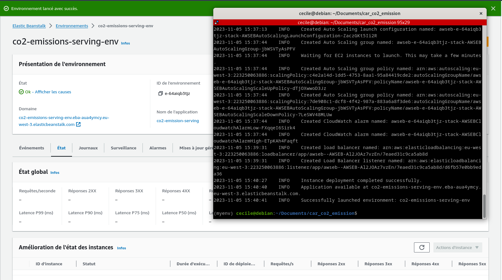
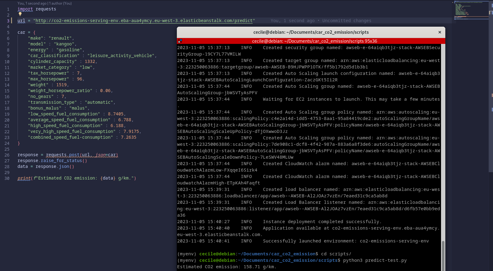

# CO2 emissions for cars sold in France

## Summary

The fight against greenhouse gas emissions is becoming an important issue in our world. By changing our habits, we can ensure that we don't add too much to global warming. One of the habits we can change is the way we travel. We can take public transport for our daily journeys, or the bus or train for journeys further afield, but sometimes we have no choice but to use the car. So it can be useful to know the CO2 emissions produced by your own vehicle, or to help you buy a new one.

The aim of this project is to help people get an idea of the CO2 emissions produced by their car, and also to help them make the right decision when buying a new vehicle. Based on the data that motorists can find in their car's documentation and using our tool, they can get an idea of their car's CO2 emissions.

## Repo Structure

```bash
.
|── data
    |── dataset.csv                         # transformed dataset
    |── original_dataset.csv                # dataset from ADEME website
|── illustrations                           # screenshots
|── notebooks
    |── 001.preparation_translation.ipynb   # preparation and translation
    |── 002.notebook.ipynb                  # analysis and modeling
|── scripts
    |── predict-test.py                     # contains a sample to test api
    |── train.py                            # train the final model
|── .gitignore
|── .dockerignore   
|── Dockerfile                              # serving the model in a container
|── Pipfile                                 # pipenv description
|── Pipfile.lock                            # pipenv packages
|── predict.py                              # Flask api
|── random_forest.bin                       # final model
└── README.md
```

## Dataset

Original dataset comes from ADEME (French Agency for Ecological Transition) and can be downloaded [here](https://data.ademe.fr/datasets/ademe-car-labelling). Data are also available in the folder [data](https://github.com/cecilegltslmcs/car_co2_emission/tree/main/data).

## Methodology

All the data was cleaned up to simplify use of the final tool. As the data comes from a French website, a translation has been made to make it easier to understand. All these modifications are included in notebook [001.preparation_translation.ipynb](https://github.com/cecilegltslmcs/car_co2_emission/blob/main/notebooks/001.preparation_translation.ipynb).

Exploratory data analysis and machine learning modelling were then carried out in notebook [002.notebook.ipynb](https://github.com/cecilegltslmcs/car_co2_emission/blob/main/notebooks/002.notebook.ipynb).

The best model was then trained and serialized in a Python script called [train.py](https://github.com/cecilegltslmcs/car_co2_emission/blob/main/scripts/train.py). The final model is deployed using Flask (code available in the [predict.py](https://github.com/cecilegltslmcs/car_co2_emission/blob/main/predict.py) script). Finally, this application was placed in a Docker [container](https://github.com/cecilegltslmcs/car_co2_emission/blob/main/Dockerfile).

## How to use the app ?

**Prerequisite:**

- Install and run Docker

**Instructions:**

- Build the image by using `docker build -t co2_emission .`

- Run the container with the command `docker run -p 9696:9696 co2_emission`
- Run the script `predict-test.py` --> [script for predictions](https://github.com/cecilegltslmcs/car_co2_emission/blob/main/predict.py)

## Deployment on Cloud using AWS ElasticBeanstalk

**Instructions:**

- Install AWS EB cli with Pipenv `pipenv install -d awsebcli`
- Create deployment environment `eb init -p "Docker running on 64bit Amazon Linux 2" -r eu-west-3 co2-emission-serving`
- Deploy api on AWS EB `eb create co2-emission-serving-env`


*Successful deployment !*


*Sending request to the API on the Cloud*